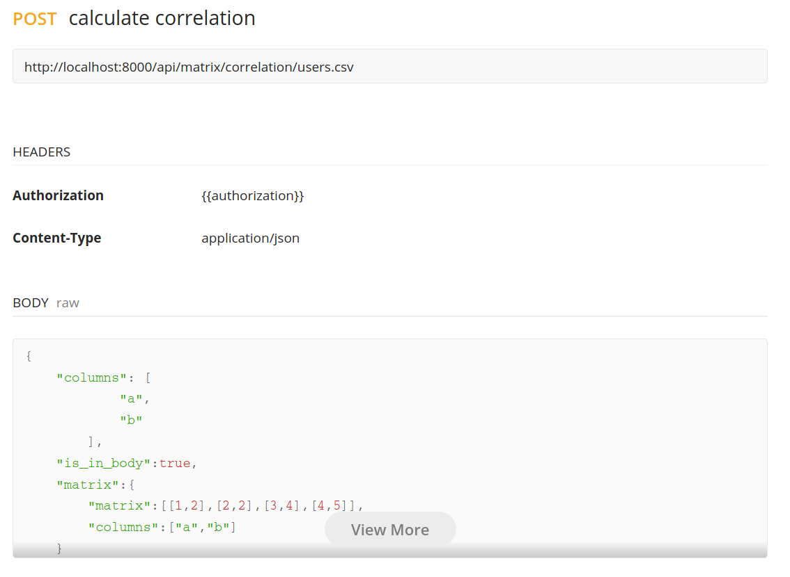

## Data analyser

This application is mainly developed to study the effect of parameter_x in a mobile radio cell on the average users in the network. This application includes two parts; the Analyzer part which is developed to perform different operations on the matrix (merging columns, grouping by columns, filtering), and calculation (correlation, regression). The second part is Result part, which is specific to default assets/users.csv file in order to have more information about the data objectives of this application. Analyzer tool is useful to perform different operation on the uploaded data.


It is composed of two separate Docker containers that holds:

- Django backend (data-analyser-backend)
- VueJs frontend (data-analyser-front)

The entry point for a user is a website which is available under the address: **http://localhost:4200/**


---

### Prerequisites

In order to run this application you need to install two tools: **Docker** & **Docker Compose**.

Instructions how to install **Docker** on [Ubuntu](https://docs.docker.com/install/linux/docker-ce/ubuntu/), [Windows](https://docs.docker.com/docker-for-windows/install/), [Mac](https://docs.docker.com/docker-for-mac/install/).

**Docker Compose** is already included in installation packs for *Windows* and *Mac*, so only Ubuntu users needs to follow [this instructions](https://docs.docker.com/compose/install/).


### How to run it?

The entire application can be run with a single command on a terminal:

```
$ sudo docker-compose up -d
```

If you want to stop it, use the following command:

```
$ sudo docker-compose down
```

---
### Run Unit Tests?

Unit tests has been added to the backend application. It includes testing the urls, views, controller. 
The unit tests are executed during the building process using DockerFile but if you want to execute them, execute this commands:

```
$ cd data-analyser-backend
```

If requirments are not installed install them:

```
$ pip3 install -r requirements.txt
```

Run Unit Tests:
```
$ python3 manage.py test
```

---

#### data-analyser-backend (REST API)

This is a Django (Python) based application that  expose the REST endpoints that can be consumed by
frontend.

Full list of available REST endpoints could be found in Postman UI,
which could be called using link: **https://documenter.getpostman.com/view/7166907/TzCQcSxr**




This app is also put in Docker container and its definition can be found
in a file *data-analyser-backend/Dockerfile*. 


#### data-analyser-frontend (Frontend)

This is a real endpoint for a user where they can manipulate their data. It consumes the REST API endpoints provided by
*data-analyser-back*.

It can be entered using link: **http://localhost:4200/**
